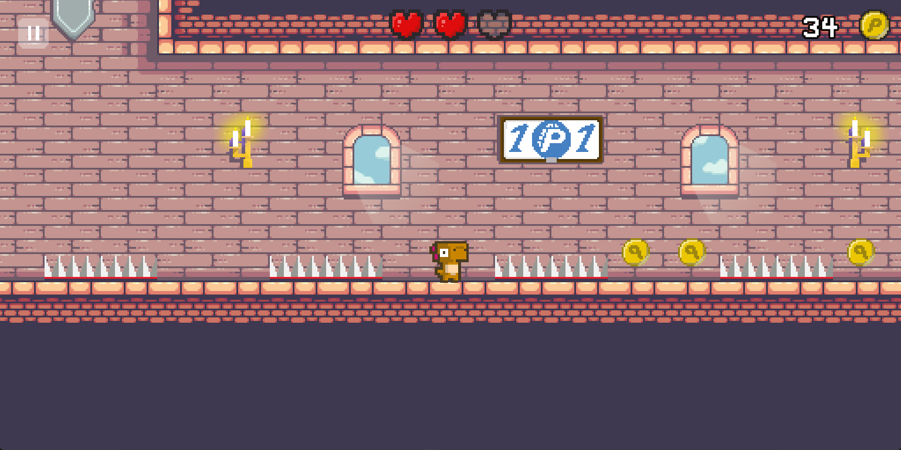

# **`HAPDino`** - Khủng long hạnh phúc

## Tác giả / Author

* Nickken

## Mô tả sản phẩm / Description

> Tiếng Việt
* **`HAPDino`** là sản phẩm game ngôn ngữ CPP, sử dụng thư viện SFML, được phát triển bởi Nickken trong suốt thời gian 1 tháng trong cuộc thi ProGameCup 2023. **`HAPDino`** là thể loại game một người góc nhìn nghiêng, hay còn gọi là "Trò chơi cuộn cảnh màn hình ngang". Người chơi sẽ vào vai 1 chú khủng long vàng tên là Happy, điều khiển Happy chạy trên màn hình, tránh các chướng ngại vật và ăn các đồng xu và qua màn để tăng điểm. Đồ họa đơn giản, màu sắc tươi sáng, giao diện thân thiện với người dùng. 
> English
* **`HAPDino`** is a CPP language game product that uses the SFML library, developed by Nickken during a period of one month in the ProGameCup 2023 competition. **`HAPDino`** is a single player game with a tilted perspective, also known as a "side-scrolling game". Players take on the role of a yellow dinosaur named Happy, controlling Happy as he runs across the screen, avoiding obstacles and collecting coins to increase their score while progressing through levels. The graphics are simple and colorful, and the user interface is friendly.

## Yêu cầu / Prerequisites

> Tiếng Việt
* Để chạy game này, bạn cần thiết bị hỗ trợ CPP và thư viện liên quan. 
* Để chạy source code:
   * Cài đặt thư viện SFML.
   * Cài đặt Visual Studio 2019.
> English
* To run this game, you need a device that supports CPP and related libraries.
* To run the source code:
   * Install the SFML library.
   * Install Visual Studio 2019.


## Cài đặt / Setup

* Clone the project
* Open in Visual Studio 2019.

## Công nghệ sử dụng / Technologies

* CPP
* SFML 
* OOP


## Demo image
> Menu của game:


> Gameplay của game:





> Sad ending:


Ngoài ra, còn có 1 ending khác, các bạn hãy tự khám phá ra nhé.
## License Information

* This software is licensed under MIT License.
* [Read More](https://choosealicense.com/licenses/mit/) on the license.


```
MIT License

Copyright (c) 2023 NickKen

Permission is hereby granted, free of charge, to any person obtaining a copy
of this software and associated documentation files (the "Software"), to deal
in the Software without restriction, including without limitation the rights
to use, copy, modify, merge, publish, distribute, sublicense, and/or sell
copies of the Software, and to permit persons to whom the Software is
furnished to do so, subject to the following conditions:

The above copyright notice and this permission notice shall be included in all
copies or substantial portions of the Software.

THE SOFTWARE IS PROVIDED "AS IS", WITHOUT WARRANTY OF ANY KIND, EXPRESS OR
IMPLIED, INCLUDING BUT NOT LIMITED TO THE WARRANTIES OF MERCHANTABILITY,
FITNESS FOR A PARTICULAR PURPOSE AND NONINFRINGEMENT. IN NO EVENT SHALL THE
AUTHORS OR COPYRIGHT HOLDERS BE LIABLE FOR ANY CLAIM, DAMAGES OR OTHER
LIABILITY, WHETHER IN AN ACTION OF CONTRACT, TORT OR OTHERWISE, ARISING FROM,
OUT OF OR IN CONNECTION WITH THE SOFTWARE OR THE USE OR OTHER DEALINGS IN THE
SOFTWARE.
```
